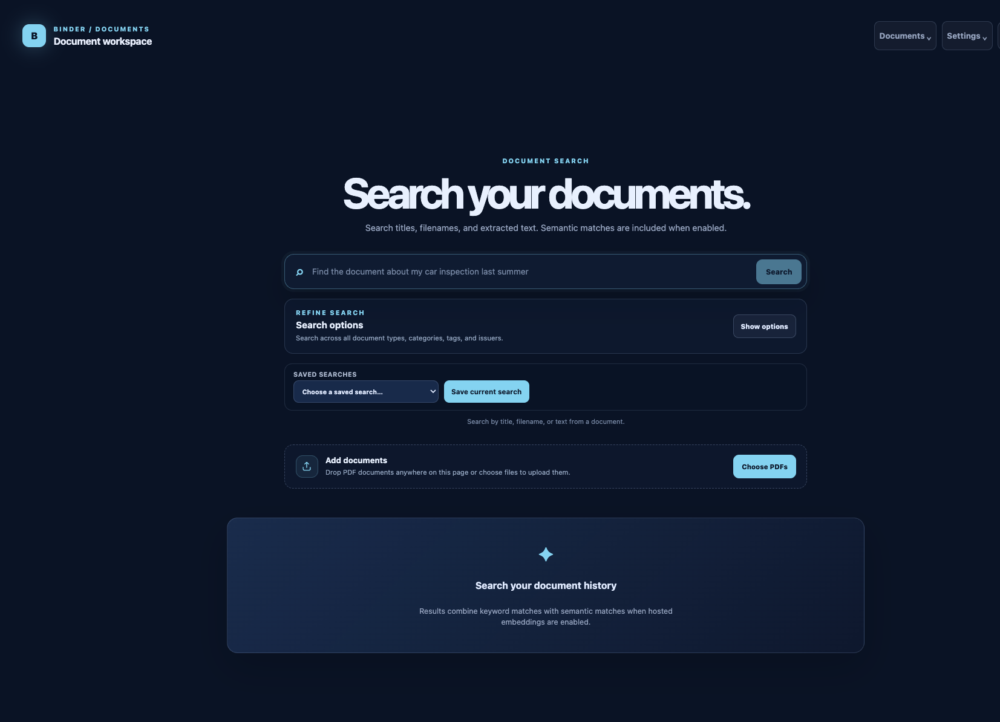

# Binder

Binder is a self-hosted document management platform for securely collecting, processing, organizing, and searching your documents.

Original files remain in your filesystem, metadata is stored in PostgreSQL, and an asynchronous worker handles scanning, OCR, text extraction, indexing, and optional AI assistance.

## Workspace

```text
packages/
├── api/      # NestJS API and server-side application
├── client/   # Angular client
├── common/   # Zod contracts and shared types
└── worker/   # Asynchronous document processing and maintenance jobs
```

## Features

- Filesystem-backed document storage with PostgreSQL metadata and durable worker processing.
- Three ingestion paths: drag-and-drop uploads, an inbox folder for scanners and external sources, and secure email/PDF import.
- Mandatory malware scanning, OCR, text extraction, thumbnails, optional PDF/A archival copies, and configurable AI assistance.
- Full-text and optional semantic search, metadata editing, issuers, folders, saved searches, audit history, and ZIP exports.
- Owner-scoped calendar events and an extensible plugin system, including optional MCP access with expiring user tokens.
- Local authentication with email-or-username login, password change, password reset, optional OIDC/SSO, and guided first-run onboarding.
- Scheduled encrypted PostgreSQL and full document backups, retention cleanup, storage consistency checks, and Dropbox support.
- Disaster-recovery onboarding with encrypted backup validation, live worker progress, mounted-volume-safe restore, and post-restore configuration review.
- Docker Compose deployment with separate API, worker, PostgreSQL, and ClamAV services.

## Getting started

The easiest way to install Binder is the included setup script. It creates the environment configuration, guides you through a new or recovery installation, and starts the Docker Compose stack:

- `api` serves the REST API and Angular client.
- `worker` handles document ingestion, malware scanning, OCR, extraction, indexing, email import, and maintenance jobs.
- `postgres` stores metadata, jobs, users, and search data using `pgvector`.
- `clamav` provides the malware-scanning daemon used by the worker.
- Shared Docker volumes hold PostgreSQL data, document storage, backups, and logs.

```bash
./scripts/setup.sh
```

The API serves the built Angular client and exposes `GET /api/v1/health`. For detailed PostgreSQL provisioning, environment configuration, migrations, onboarding, email, backup, and recovery instructions, see the [Binder setup guide](./docs/setup.md).

Advanced Compose users can run `docker compose up -d --build` after preparing `.env` manually.

## Local development

For developing Binder itself, install the workspace dependencies and run the development services locally:

```bash
pnpm install
pnpm db:up
pnpm build
pnpm dev
```

See [`docs/README.md`](./docs/README.md) for the product and architecture decisions.
